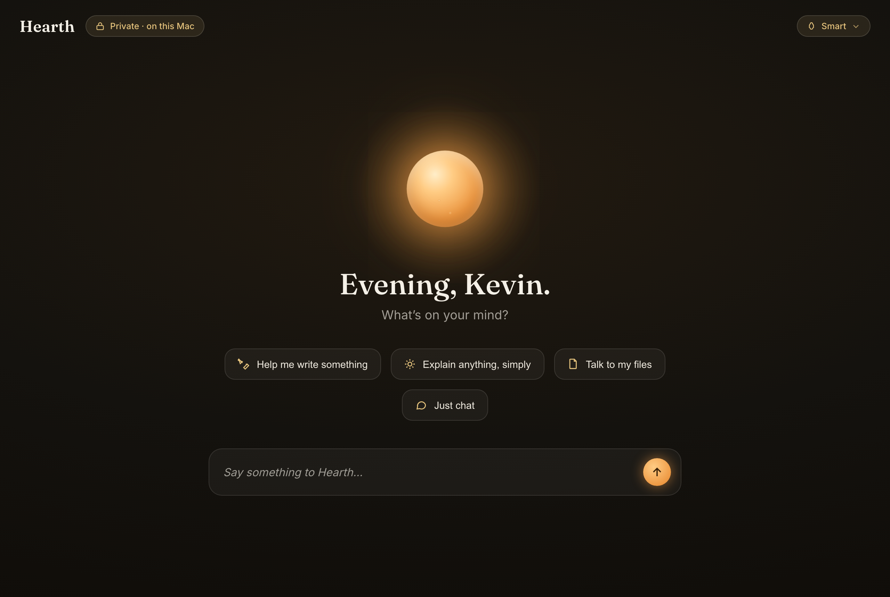
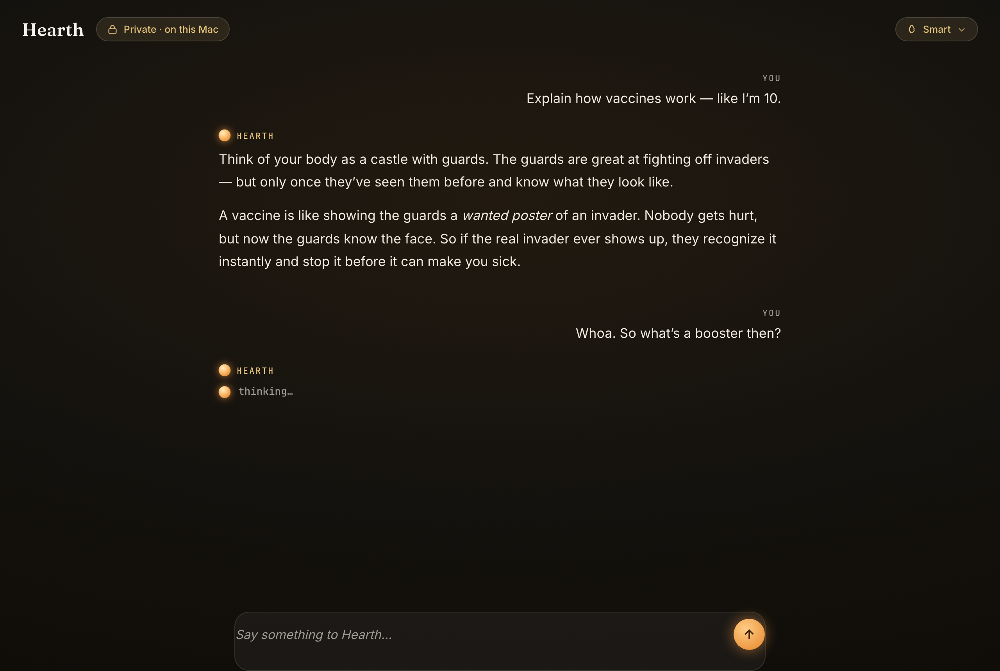

# 🔥 Hearth

### A warm light in a cold cloud.

A beautiful, **free**, fully-local AI that runs entirely on your own computer.
No account. No internet required. Nobody watching. Your mom could use it.

---

## What is this?

Every AI you've used lives in someone else's data center — metered, logged, and one
outage away from gone. Hearth is the opposite: a calm, gorgeous AI that runs **on your
machine**, works **offline**, costs **nothing**, and keeps every word **private**.

It's built for people who've never heard the word "LLM." You open it, and you're
talking to it in seconds.

## Why local?

- 🔒 **Private by nature** — your conversations never leave your computer.
- ♾️ **Unlimited & free** — no caps, no counters, no subscription. It runs on *your*
  hardware, so there's nothing to bill.
- ✈️ **Works offline** — on a plane, in a cabin, anywhere. No internet needed once set up.
- 🏡 **Yours** — no account, no login, no tracking. It lives with you.

## A look

| Home (night) | Conversation (night) |
|---|---|
|  |  |

*Design mockup — open `mockup/index.html` in a browser to watch the ember breathe.*

## Design language

Hearth rejects the blue-glow, circuit-board, robot aesthetic of every other AI tool.
The guiding idea: **intelligence as warm light, not cold tech.** A breathing ember is
the AI's presence — warm paper by day, a glowing hearth in a dark room by night.

- **Type:** Fraunces (display) · Inter (body) · JetBrains Mono (labels)
- **Color:** Warm Paper `#FBFAF7` · Ink `#2B2720` · Brass `#C8A15A` · Ember `#FFCC84 → #EE9A45`
- **Feel:** a calm companion, not a cockpit.

## How it works (planned)

- **Shell:** [Tauri](https://tauri.app) — a lean, native desktop app.
- **Interface:** custom-built — the entire point is the UX.
- **Engine:** bundles [Ollama](https://ollama.com) as a silent sidecar, so you install **one** thing.
- **Models:** open-weight models (Qwen, Llama, Mistral) shipped as quantized GGUF.
- **Instant first run:** a tiny model ships *inside* the app so your first reply arrives in
  seconds, while a smarter model downloads in the background. Hearth detects your hardware
  and picks the right brain — **Fast · Smart · Genius** — automatically.

## Status

🌱 Early — design + interactive mockup complete. Built in the open.

---

*Made by [Kevin Champlin](https://kevinchamplin.com).*
